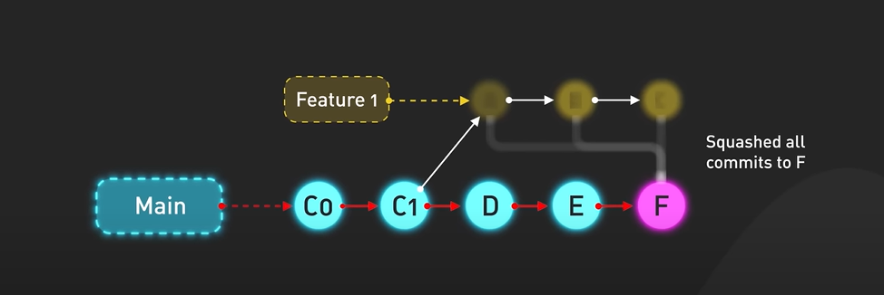
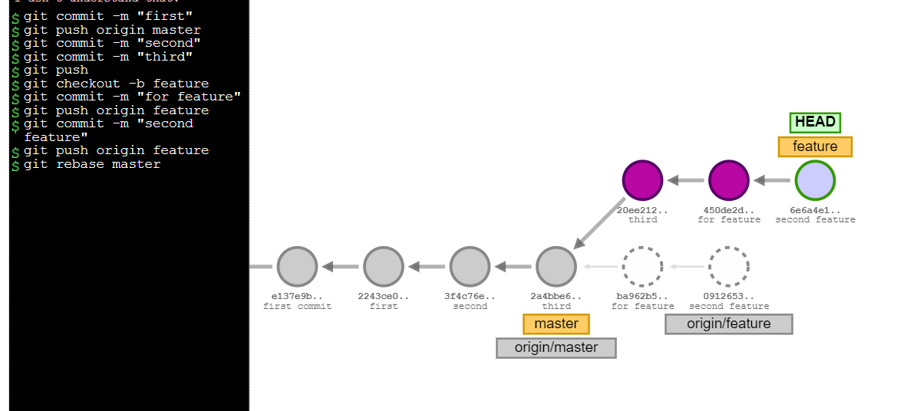
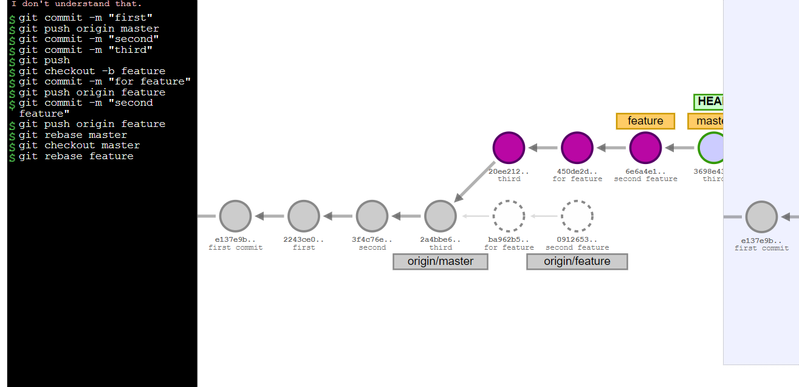

## Advanced Git Concepts

1) Explain the purpose of tags and how to create and manage them.
2) Discuss the concept of rebasing and its use cases.
3) [Compare rebase with merging (hands-on activity)](#compare-rebase-with-merging-hands-on-activity)

### What is the **Git Squash**?
- All feature commits are squeezed into a single commit
- We lose the fine details of individual **feature commits** in the **main branch's commit history**




### What is the **Git Rebase**?
- All in one line
- Merge is always a forward moving change record. Alternatively, rebase has powerful history rewriting features.
- In a background git is actually blowing away the feature branch commits and duplicating them as new commit on top of the master branch (thats why)
- Rebase is **recreating your work from one branch onto another.**


### Merge vs Rebase vs Squash
- ```git merge``` gives us complete picture of the commit history and branch evolution
- ```git rebase``` tidies up history by moving commits to the main branch tip
- ```Squashing``` commits consolidates commits into one, providing a clean, linear history in the main branch


### Compare rebase with merging (hands-on activity) 



- ```git checkout feature```
- ```git rebase master```
---
---



- ```git checkout master```
- ```git rebase feature```