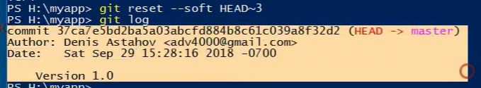

- ```git reflog``` Git tracks a history of checkout operations in the reflog. You can execute git reflog to view the history.

- The reference logs store information about when the tips of branches were updated and what the previous commit references were.

---
- ```git commit --amend``` Git allows you to amend the most recent commit. Don't creating the new commit it's just add changes to the previous commit.
#### ```Git reset``` *command in Git is used to move the current branch pointer to a specified commit*
- ```git reset --hard HEAD~2``` Git allows you to reset the HEAD two previous commit.


- ```git reset --soft HEAD~2``` Git allows you to reset the HEAD two previous commit. 

---
---

```--soft``` – The staged snapshot and working directory are not altered in any way.

```--mixed``` – The staged snapshot is updated to match the specified commit, but the working directory is not affected. This is the default option.

```--hard``` – The staged snapshot and the working directory are both updated to match the specified commit.